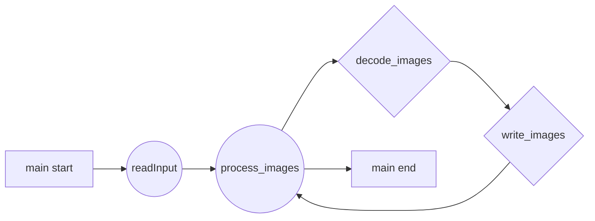

# JPEG Decoder with CUDA

original : https://github.com/NVIDIA/CUDALibrarySamples/blob/master/nvJPEG/nvJPEG-Decoder/README.md    

Tested :  MS WIndows 10 Pro, x64, Viual studio 2022(v143), Windows SDK 10.0.19041.0    

Modified By Kiok Ahn (kiokahn@gazzi.ai, kiokahn76@gmail.com)    

# Test

Reference : decode.bat
Example : 
```
nvjpegDecoder.exe -i G:\source\CUDALibrarySamples\nvJPEG\nvJPEG-Decoder_build\Debug\img\ -o G:\source\CUDALibrarySamples\nvJPEG\nvJPEG-Decoder_build\Debug\out\ -fmt rgb
```

# Requirements


- [ Visual Studio Community](https://visualstudio.microsoft.com/ko/vs/community/)    
- Windows SDK 10.0.xxxxx    
- [NVIDIA GPU Computing Toolkit v11.7](https://developer.nvidia.com/cuda-downloads?target_os=Windows&target_arch=x86_64&target_version=11&target_type=exe_local)    


# Key Functions

### nvjpegDecoder.cpp

- 주요 함수  : process_images(...)    
double process_images(FileNames &image_names, decode_params_t &params, double &total)    
```
기능 : 이미지 디코딩 주요 처리 함수
입력 데이터 : FileNames &image_names
             의미 : 디코딩할 JPEG 파일 경로의 목록, 벡터
입력 데이터 : decode_params_t &params
             의미 : GPU 디코딩 기반 정보
```

- 주요 함수  : decode_images(...)    
int decode_images(const FileData &img_data, const std::vector<size_t> &img_len, std::vector<nvjpegImage_t> &out, decode_params_t &params, double &time)     
```
기능 : GPU를 이용한 데이터 디코딩
입력데이터 : const FileData &img_data
             정의 : typedef std::vector<std::vector<char> > FileData;
             의미 : JPEG 인코딩된 로 데이터 버퍼들의 벡터, 
출력 데이터 : std::vector<nvjpegImage_t> &out
             의미 : 디코딩된 로 데이터 버퍼들의 벡터, 
                    RGB, YUV등의 데이터 형식은 "decode_params_t &params" 에 의해 결정 됨
```

- 주요 함수  : write_images(...)    
int write_images(std::vector<nvjpegImage_t> &iout, std::vector<int> &widths, std::vector<int> &heights, decode_params_t &params, FileNames &filenames)
기능 : 디코딩 된 로 데이터 버퍼를 디스크에 기록 함
입력 데이터 : std::vector<nvjpegImage_t> &iout
             의미 : 디코딩 완료된 로 데이터의 백터
입력 데이터 : std::vector<int> &widths
             의미 : 디코딩 완료된 로 데이터의 가로 화소 크기 백터
입력 데이터 : std::vector<int> &heights
             의미 : 디코딩 완료된 로 데이터의 세로 화소 크기 백터


## Flow chart


